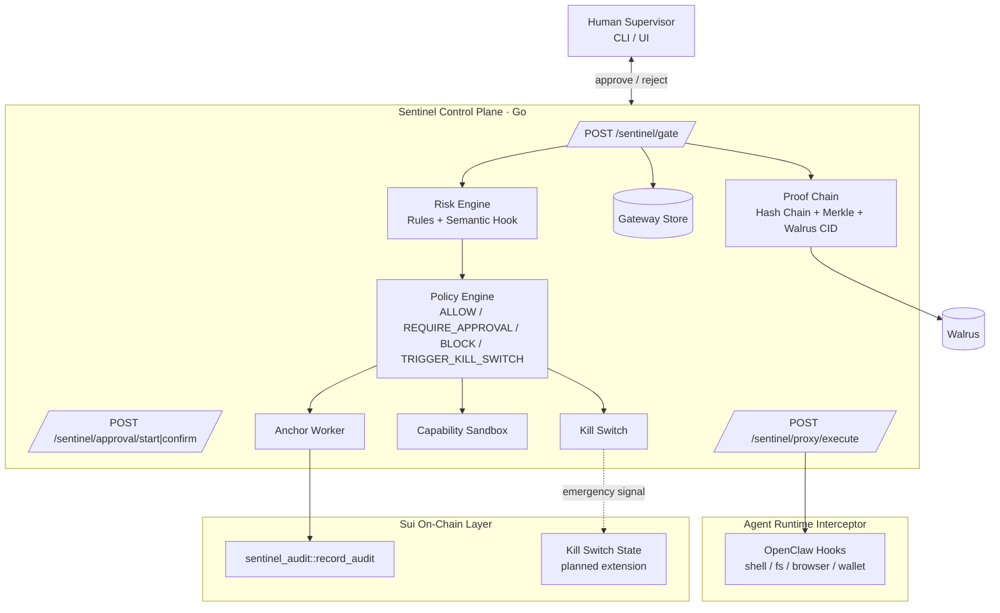

# Sentinel Architecture

## 1) Layered Architecture



## 2) End-to-End Flow (Normal + Attack)

```mermaid
flowchart LR
    A[Agent Action] --> B[Interceptor]
    B --> C[/sentinel/gate]
    C --> D[Risk Engine]
    D --> E[Policy Engine]

    E -- ALLOW --> F[Issue One-Time Token]
    F --> G[/sentinel/proxy/execute]
    G --> H[Executor Report]

    E -- REQUIRE_APPROVAL --> I[Human Approval]
    I -- approve --> F
    I -- reject --> J[Blocked]

    E -- BLOCK --> J
    E -- TRIGGER_KILL_SWITCH --> K[Kill Switch ON]
    K --> J

    H --> L[Proof Chain]
    J --> L
    L --> M[Merkle Batch]
    M --> N[Walrus CID]
    N --> O[Sui Anchor]
```

## 3) Module-to-Code Mapping

| Module | Source File |
|--------|-----------|
| HTTP Gateway & Routes | `goserver/sentinel_gateway_http.go` |
| Risk & Policy Engine | `goserver/sentinel_guard.go`, `goserver/sentinel_risk_engine.go` (alias) |
| Behavioral Detection | `goserver/behavioral_detection.go`, `goserver/policy_gate_integration_example.go` |
| Approval Service | `goserver/sentinel_approval_service.go` |
| Execute Guard (One-Time Token) | `goserver/sentinel_executor_http.go` |
| Controls (Kill Switch + Sandbox) | `goserver/sentinel_controls.go` |
| Proof Chain (Hash + Merkle + Walrus) | `goserver/sentinel_proof_chain.go` |
| On-Chain Anchor | `goserver/sentinel_guard.go` (anchorToSui), `contract/sources/sentinel_audit.move` |
| OpenClaw Integration | `goserver/openclaw_integration.go` |
| Entry Point & Proxy Mode | `goserver/main.go` |

## 4) Demo Mapping

| Demo Scenario | Modules Exercised |
|--------------|------------------|
| Prompt injection interception | Risk Engine + Policy Engine |
| Wallet high-risk action held | Approval Service + Policy Engine |
| Emergency shutdown | Kill Switch (manual arm + consecutive auto-arm) |
| Behavior verifiable | Proof Chain + Sui Anchor |
| One-time token replay protection | Execute Guard |
| Capability sandbox enforcement | Capability Sandbox |
